# Employee Management System

**Employee Management System built with Spring Boot, REST APIs, JPA/Hibernate, DTOs, Validation, and Spring Security with role-based access control.**

A secure full-stack Employee Management System built with **Java, Spring Boot, Spring Security, JWT, Spring Data JPA, Microsoft SQL Server (MSSQL), and JavaScript**.

The system provides employee management, leave requests, salary advance requests, authentication, role-based authorization, employee-level data isolation, and administrative approval workflows.

---

## Tech Stack

- **Backend:** Java, Spring Boot
- **Security:** Spring Security, JWT, BCrypt
- **Database:** Microsoft SQL Server (MSSQL)
- **ORM:** Spring Data JPA / Hibernate
- **Frontend:** HTML, CSS, JavaScript
- **API Testing:** Postman
- **Architecture:** Controller → Service → Repository

---

## Key Features

- JWT-based authentication
- Role-Based Access Control (ADMIN / EMPLOYEE)
- Employee-level data isolation
- Employee management
- Leave request management
- Salary advance request management
- Admin approval and rejection workflows
- RESTful CRUD APIs
- DTO-based request/response handling
- Server-side validation
- Centralized exception handling
- Relational database mapping
- Secure authenticated API communication

---

# Quick Overview

## ADMIN

Administrators can:

- View and manage employees
- Add new employees
- View all leave requests
- Approve or reject leave requests
- View all salary advance requests
- Approve or reject salary advance requests

## EMPLOYEE

Employees can:

- Log in securely
- Submit leave requests
- Submit salary advance requests
- View their own requests
- Track request status

Employees cannot access another employee's requests.

---

# Screenshots

## 1. Login

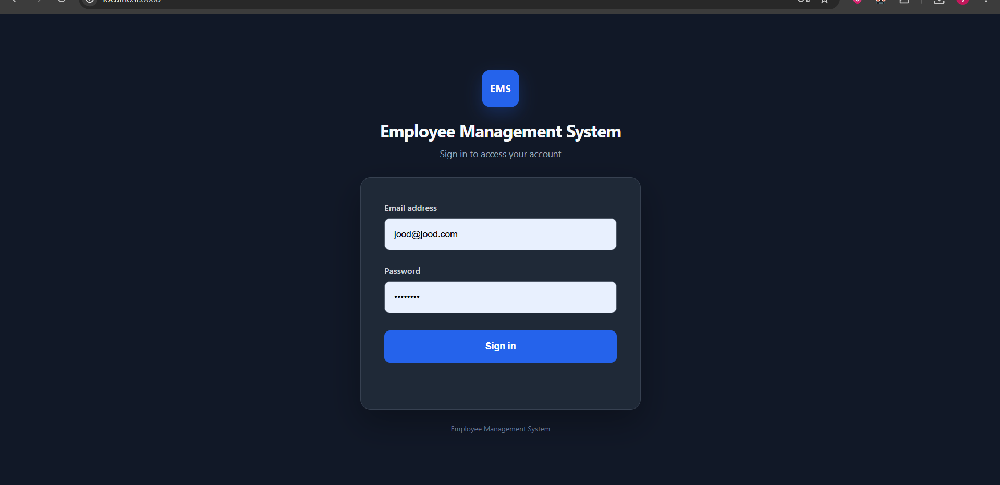

Secure login using employee or administrator credentials.

---

## 2. Admin Dashboard For Employees

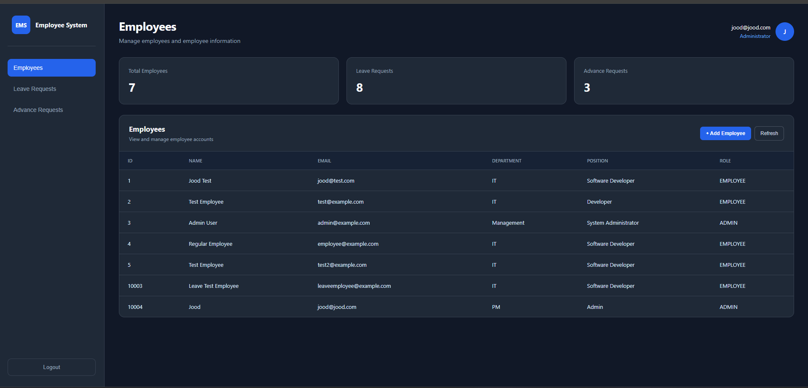

The employee dashboard provides access to employee information and employee-related requests.

---

## 3. Leave Requests

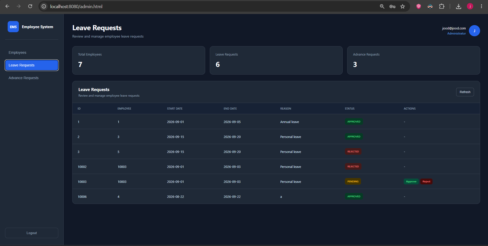

Administrators can review employee leave requests and manage their status.

---

## 4. Salary Advance Requests

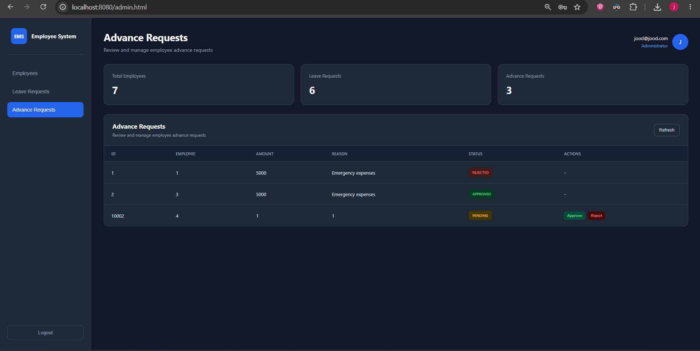

Administrators can review employee salary advance requests and manage their status.

---

## 5. Add Employee

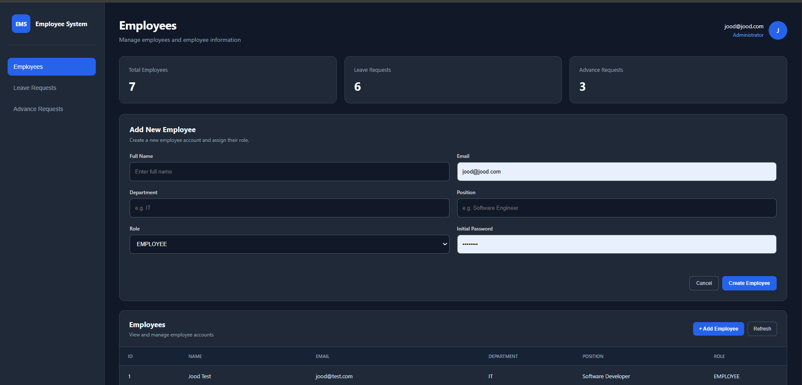

Administrators can create new employee accounts and assign their roles.

---

## 6. Employee Dashboard

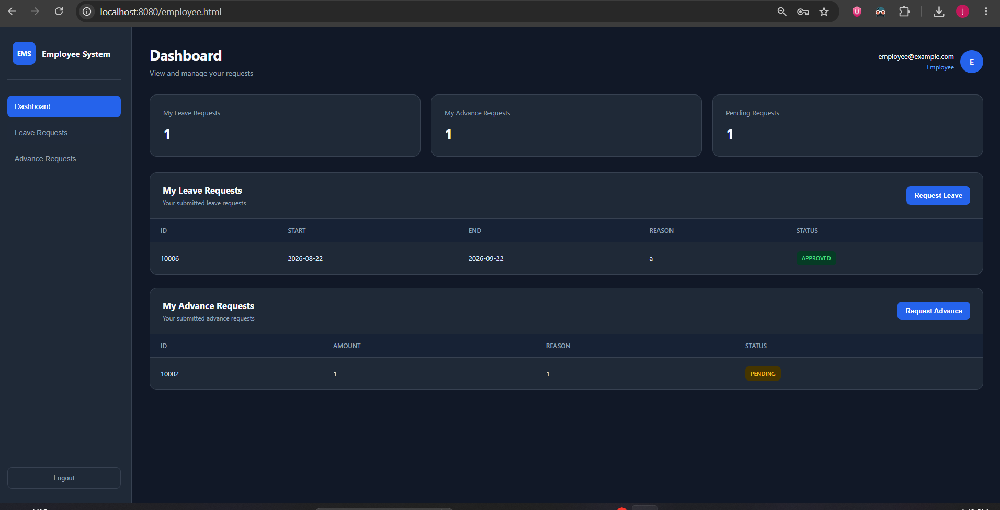

Employees can view their own requests and track their current status.

---

## 7. Leave Request Form

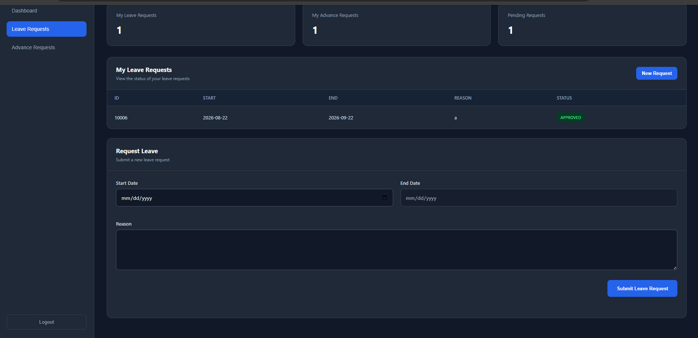

Employees can submit leave requests by providing a start date, end date, and reason.

---

## 8. Leave Request Management

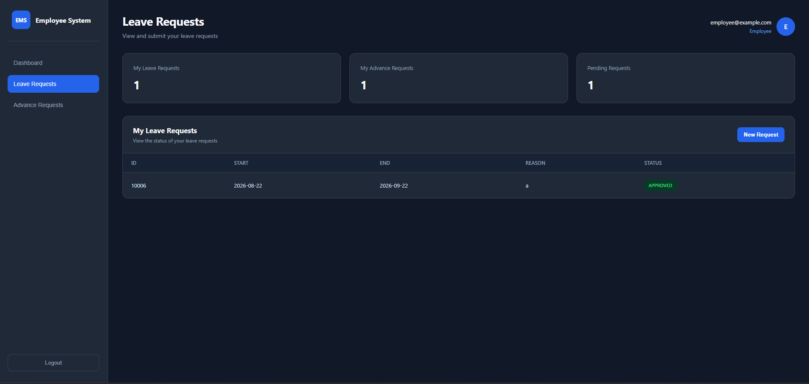

Leave requests are displayed with their employee, dates, reason, status, and available actions.

---

## 9. Salary Advance Request Form

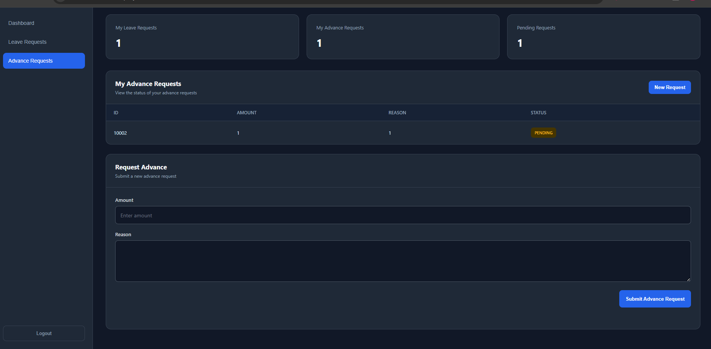

Employees can submit salary advance requests by providing an amount and reason.

---

## 10. Salary Advance Management

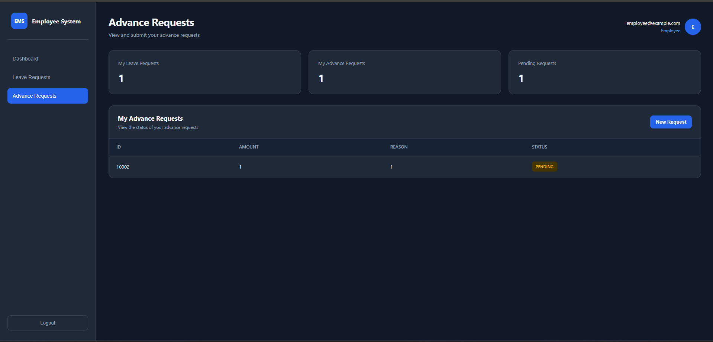

Salary advance requests are displayed with their employee, requested amount, reason, and status.

---

## 11. Input Validation

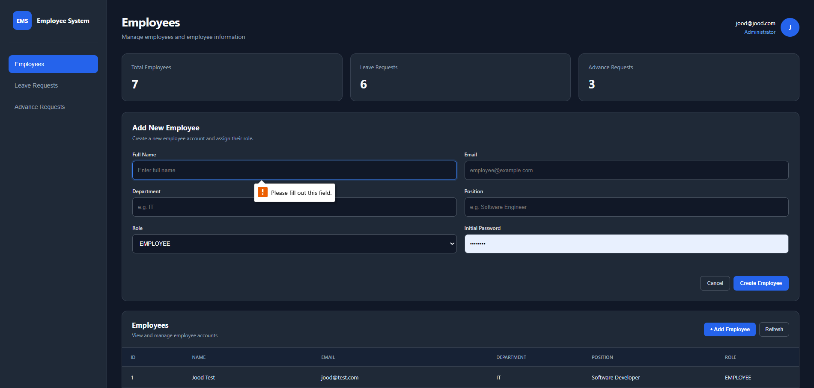

The application validates user input before processing requests. For example, email fields must contain a valid email format and advance amounts must be greater than zero.

---

## 12. Exception Handling

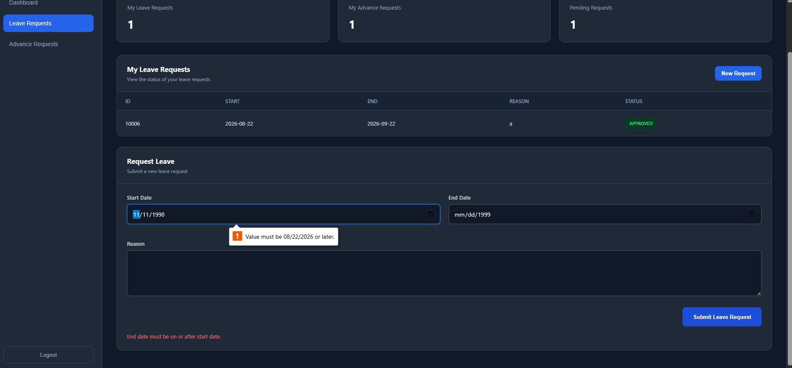

The application handles invalid requests and displays an appropriate error message when a leave request uses a start date in the past.

---

# Detailed Documentation

## 1. System Architecture

The backend follows a layered architecture:

```text
Controller
    ↓
Service
    ↓
Repository
    ↓
Database
